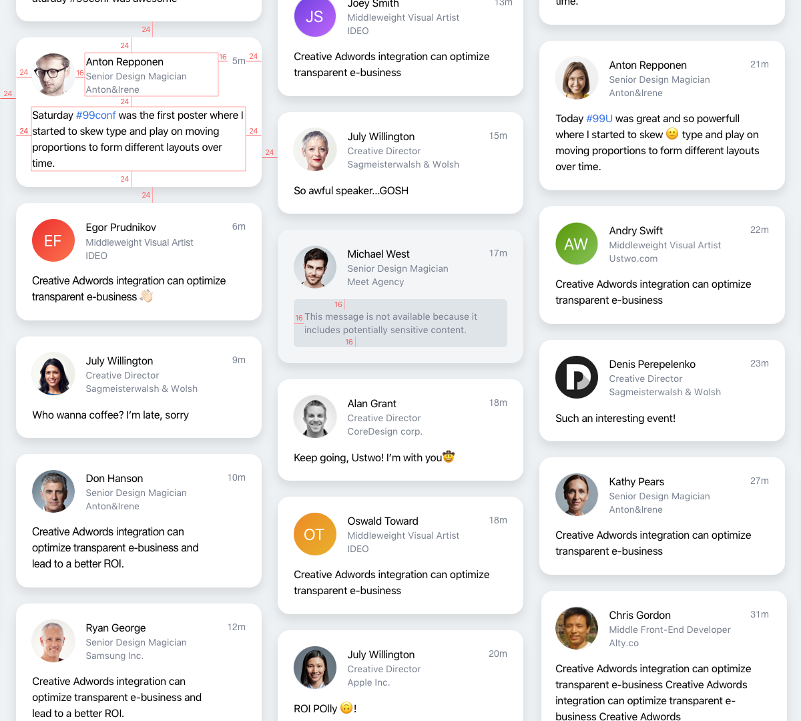

# FrontEnd assignment


## Intro
Event Wall is a real-time display solution that takes the last message. It was implemented as a script which automatically fetches new messages and adds them to the beginning of the container (prepend).
Messages which should be added have next structure:

```html
<article class="post" data-id="{MESSAGE-ID}">
  <header>
    
    <div>
      <span class="author">{NAME-OF-AUTHOR}</span>
      <span class="position">{OCCUPATION-OF-AUTHOR}</span>
    </div>
    <span class="time">{WHEN-MSG-ADDED}</span>
  </header>
  <p class="text">{TEXT-OF-MESSAGE}</p>
</article>
```

Also the script presents global object `AttendifyEventWall` with the following public methods:
* `startWall()` -- start message update
* `toggleBanMessage(id)` -- ban/cancel ban of message

## Design




## Preparing
1. Fork this repo
1. Create *package.json* (Using **npm** or **yarn**)
1. Update index.html and add into this page container for messages. It should has attribute `data-wall="attendify"`
1. Initialize *Attendify Event Wall*: Run `AttendifyEventWall.startWall()` when document has been loaded.

## Challenge
* (HTML/CSS) Implement styles according to the given design.
* (JavaScript) Implement moderation of messages: double click on text of message should toggle (add or cancel) ban of message. Use AttendifyEventWall.toggleBanMessage(id) method to achieve this
* (HTML/CSS, *optional*) Create responsive markup with the following breakpoints:
  * **mobile**: `width <= 480 px`: 1 column, width 100%
  * **tablet**: `width <= 768 px`: 2 columns, width 100% (the whole width of column)
  * **desktop**: `width > 768 px`: 3 columns, fixed width 360px.You should centre the container
* (*Optional*) Send your solution as Pull Request.
  

## Requirements:
* CrossBrowser style. (IE11+ and other modern browsers)
* The flow of messages should follow from top to bottom, split into columns which follow from left to right.
  * New items are appended to stack in columns. 
  * If item doesn't fit into height of container, it should be moved in the next column.
  * Container should have fixed height, not bigger than viewport height. Width may vary.
* **Mandatory**. The styles should be designed with using of preprocessors.
* **Mandatory**. The project should contain package.json. To launch the project you should use the following commands:
  * `npm install`  -- install required dependencies
  * `npm start` -- project build and its launch in browser
 
*Yarn can be used instead of npm.*


